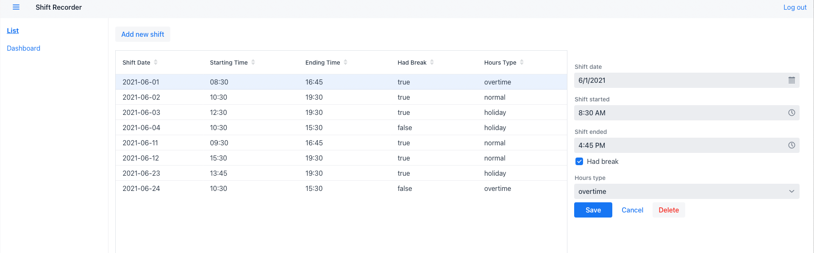
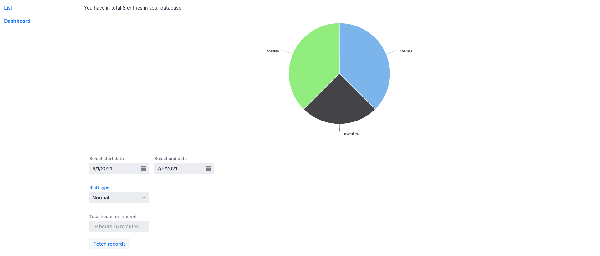

## ShiftManager
- ShiftManager helps you keep track of your worked hours.
- It has a beautiful chart which provides an overview of your worked hours, organised by type.

### Installation

- Click on the 'Releases' and download the jar file. 
- Make sure you have Java installed on your machine.
- This release comes with a pre-loaded in-memory database(H2).
- If you use Docker, you can find an image available on [Docker Hub](https://hub.docker.com/repository/docker/peter355/shift-manager): 
  - Run: docker pull peter355/shift-manager:latest ;
- Use the credentials mentioned on the Login page.

### Single page app baked with
- SpringBoot
- Spring Security
- Vaadin

### Screenshots

